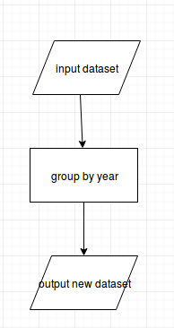

# parse-xml

[](https://travis-ci.org/Eleonore9/xml-to-model-structure) [](http://waffle.io/Eleonore9/xml-to-model-structure)

## Table of contents

* [Aim](#aim)
* [Glossary](#glossary)
* [Status](#status)
* [Contribute](#contribute)
* [Description](#description)

## Aim

To create a model diagram using [draw.io](https://www.draw.io/) export it as an XML file and create a structure for a model to be run on the [workspace-executor](https://github.com/MastodonC/witan.workspace-executor) using tools from the [workspace-api](https://github.com/MastodonC/witan.workspace-api), just like other models written for Witan like:

* [witan.models.demography](https://github.com/MastodonC/witan.models.demography)
* [witan.models.household](https://github.com/MastodonC/witan.models.household)
* [witan.gwyn](https://github.com/MastodonC/witan.gwyn)

## Glossary

* __Model__: Here the term "model" is used both for 1) a succession of transformations on one or several input dataset(s) to produce one or several output dataset(s), 2) a data structure containing all info to run a model (as defined in 1) created using a macro defined in the [workspace-api](https://github.com/MastodonC/witan.workspace-api).

* __Workflow__: This term refers to a data structure defined by in the [workspace-api](https://github.com/MastodonC/witan.workspace-api) to be associated with a model (and inspired by Onyx). It describes a succession of steps as a collection of collections like: `[[:step1 :step2] [:step2 :step3] [:step3 :step4]]`.

* __Catalog__: This also refer to a data structure defined by in the [workspace-api](https://github.com/MastodonC/witan.workspace-api). It is a collection of maps containing metadata for each step of the model. It especially defines a step as an "input", a "function" or an "output" step.

## Status

Work in progress to reach the MVP1 milestone:

* User can produce a "pre model" (a workflow + a catalog) for a basic diagram.

* User gets an error (with a descriptive message) if the diagram file is broken and thus can't be used.

* User can produce a new Clojure project with new namespaces needed to create a model.

## Contribute
* Source code: [github.com/MastodonC/xml-to-model-structure](https://github.com/MastodonC/xml-to-model-structure)
* Issue tracker: [https://github.com/Eleonore9/xml-to-model-structure/issues](https://github.com/Eleonore9/xml-to-model-structure/issues)
* Waffle board: [https://waffle.io/Eleonore9/xml-to-model-structure](https://waffle.io/Eleonore9/xml-to-model-structure)

## Description

You can create a diagram/flowchart for a model using [draw.io](https://www.draw.io/) and export it as XML (don't compress it).

Example of a model diagram/flowchart:


From the repl you can run the main function using the XML file path to create the "pre model":

```Clojure
(-main "dev-resources/test-diagram5.xml" "/home/user/Documents/" "my-model")))
```

This prints a data structure containing the model workflow (steps of the model), and catalog (metadata for each step of the model):

```Clojure
{:workflow [[:input-dataset :group-by-year]
            [:group-by-year :output-new-dataset]]
 :catalog [{:witan/name :input-dataset :witan/version "1.0.0"
            :witan/type :input :witan/fn :model/input-dataset :witan/params {:src ""}}
           {:witan/name :group-by-year :witan/version "1.0.0"
            :witan/type :function :witan/fn :model/group-by-year}
           {:witan/name :output-new-dataset :witan/version "1.0.0"
            :witan/type :output :witan/fn :model/output-new-dataset}]}
```
This is added to a project model using the name you specified ("my-model") and in the directory you specified ("/home/user/Documents/").

Calling the `-main` function outputs the following messages:

```
17-06-15 16:26:35 eleonore-XPS13-9333 INFO [parse-xml.core:25] - Parsing the XML from dev-resources/test-diagram5.xml
17-06-15 16:26:35 eleonore-XPS13-9333 INFO [parse-xml.core:82] - Creating the workflow and catalog
17-06-15 16:26:35 eleonore-XPS13-9333 INFO [parse-xml.core:111] - Creating a new witan-model project my-model3 at /home/eleonore/Documents/ ...

```

**Note**
If the arrows in the diagram aren't connected to a box, then we can't automate the creation of a model and this error message is returned:

```
"!DANGER! The flowchart has 1 disconnected arrows.
You CANNOT proceed with creating a model. Go fix your diagram first!"
```

## License

Copyright © 2016 FIXME

Distributed under the Eclipse Public License either version 1.0 or (at
your option) any later version.
